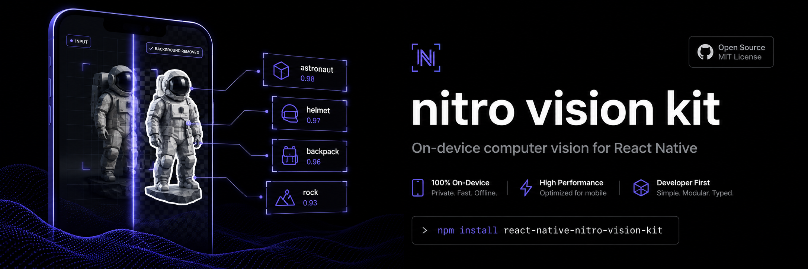
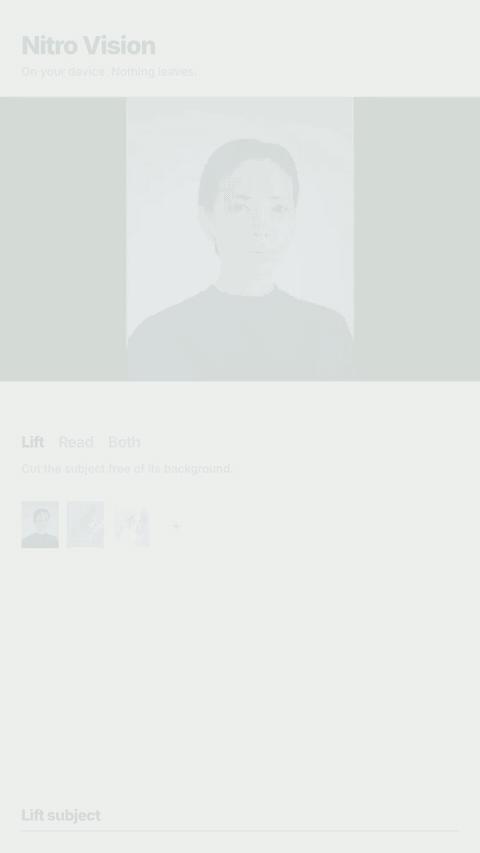

<p align="center">
  
</p>

<p align="center">
  <a href="https://www.npmjs.com/package/react-native-nitro-vision-kit"></a>
  <a href="https://github.com/sagawrr/react-native-nitro-vision-kit/actions/workflows/ci.yml"></a>
  <a href="./LICENSE"></a>
</p>

<p align="center">
  <strong>Cut subjects free. Label what's in the frame.</strong><br />
  On-device vision for React Native — Vision on iOS, ML Kit on Android,<br />
  bridged with <a href="https://nitro.margelo.com">Nitro Modules</a>.
</p>

<p align="center">
  
</p>

---

## Install

```bash
npm install react-native-nitro-vision-kit react-native-nitro-modules
cd ios && pod install
```

## Quick start

Pass a **local** path or `file://` URI. Remote images need to be cached first.
Orientation is handled for you — pass the file as-is.

```ts
import { VisionKit } from 'react-native-nitro-vision-kit'

const { segmentation, classifications } = await VisionKit.analyzeImage(path, {
  removeBackground: { trim: true },
  classify: { maxResults: 5, minConfidence: 0.5 },
})

const png = await segmentation?.saveToTemporaryFile('png', 100)
segmentation?.dispose()
```

Prefer separate calls? Same idea:

```ts
const cutout = await VisionKit.removeBackground(path, { trim: true })
const labels = await VisionKit.classifyImage(path, { maxResults: 5 })

await cutout.saveToTemporaryFile('png', 100)
cutout.dispose()
```

> Always call `dispose()` when you're done with a segmentation result.

## What you get

| | Method | Notes |
| --- | --- | --- |
| **Lift** | `removeBackground` | Transparent subject cutout |
| **Read** | `classifyImage` | Labels with confidence |
| **Both** | `analyzeImage` | One decode — segment and/or classify |

Check availability before lifting:

```ts
const { supportsBackgroundRemoval, backgroundRemovalUnavailableReason } =
  VisionKit.capabilities
```

| Platform | Segment | Classify |
| --- | --- | --- |
| iOS | 17.0+ | 13.0+ |
| Android | ML Kit + Play services | ML Kit |

## Options

**`removeBackground` / `analyzeImage.removeBackground`**

| Option | Default | |
| --- | --- | --- |
| `trim` | `true` | Crop to the subject |
| `maxPixels` | `6_000_000` | Decode cap (`width × height`) |
| `retainMask` | `false` | Keep mask for `toMaskBuffer()` |

**`classifyImage` / `analyzeImage.classify`**

| Option | Default | |
| --- | --- | --- |
| `maxResults` | `0` | Cap labels (`0` = all above threshold) |
| `minConfidence` | `0.5` | Minimum score |
| `region` | full image | Normalized ROI (`0–1`) |

When `analyzeImage` runs both and you omit `region`, classification uses the subject bounds.

## Segmentation result

| | |
| --- | --- |
| `saveToTemporaryFile(format, quality)` | Write a PNG or JPEG |
| `toArrayBuffer()` | Premultiplied RGBA bytes |
| `toMaskBuffer()` | Float32 mask (needs `retainMask`) |
| `dispose()` | Free native memory |
| `width` / `height` | Output size |
| `bounds` | Subject box, normalized `0–1` |
| `foregroundCoverage` | Foreground pixel ratio |

## Example

A small playground lives in [`example/`](./example). The GIF above is that flow: **Lift** → cutout → **Both** → labels → **Keep**.

```bash
cd example
npm install
cd ios && bundle install && bundle exec pod install && cd ..
npm run ios   # or: npm run android
```

Pick a photo → **Lift**, **Read**, or **Both** → **Keep** to save a cutout.

## License

[MIT](./LICENSE)
