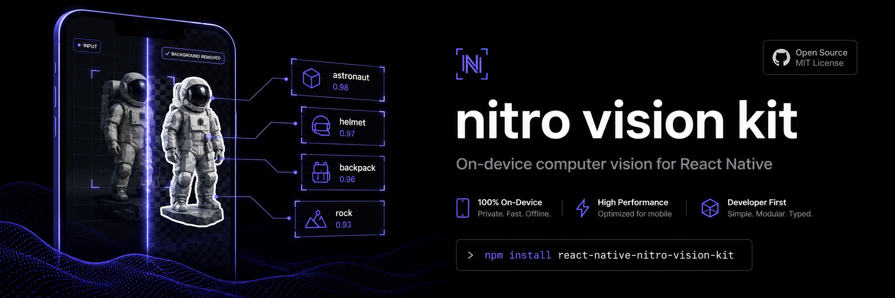
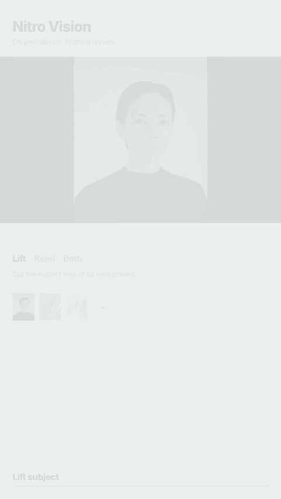

<p align="center">
  
</p>

<p align="center">
  <a href="https://www.npmjs.com/package/react-native-nitro-vision-kit"></a>
  <a href="https://github.com/sagawrr/react-native-nitro-vision-kit/actions/workflows/ci.yml"></a>
  <a href="./LICENSE"></a>
</p>

<h1 align="center">Nitro Vision</h1>

<p align="center">
  React Native library for subject cutouts, image labels, and text reading.<br />
  Processing runs on the device.<br />
  <sub>
    <a href="https://developer.apple.com/documentation/vision">Vision</a> (iOS) ·
    <a href="https://developers.google.com/ml-kit">ML Kit</a> (Android) ·
    <a href="https://nitro.margelo.com">Nitro Modules</a>
  </sub>
</p>

---

## Install

```bash
npm install react-native-nitro-vision-kit react-native-nitro-modules
cd ios && pod install
```

| | Minimum |
| --- | --- |
| React Native | 0.75 |
| [`react-native-nitro-modules`](https://nitro.margelo.com) | 0.36.0 |
| iOS | 13 (cutouts need 17, text needs 18) |
| Android | API 24 |

The New Architecture is a better choice. Nitro works best with it.

---

## API

```ts
import { VisionKit } from 'react-native-nitro-vision-kit'
```

Some results are HybridObjects. A HybridObject holds memory on the native side. Call `dispose()` when the result is no longer needed. Export or save before `dispose()`.

### Capabilities

| Field | Meaning |
| --- | --- |
| `supportsBackgroundRemoval` | Cutouts are available |
| `backgroundRemovalUnavailableReason` | Why cutouts are off |
| `supportsImageClassification` | Labels are available |
| `supportsTextRecognition` | Text reading is available |
| `supportedTextLanguages` | Language tags that can be requested |

### `removeBackground(path, options?)`

Returns a cutout HybridObject.

| | |
| --- | --- |
| iOS | 17+ |
| Android | API 24+, Play Services, ML Kit subject cutout (beta) |
| Export | `saveToTemporaryFile(format, quality)`, `toArrayBuffer()`, `toMaskBuffer()` |

| Option | Default | Meaning |
| --- | --- | --- |
| `trim` | `true` | Crop to the subject |
| `maxPixels` | `6_000_000` | Max pixels when loading the image |
| `retainMask` | `false` | Keep the mask for `toMaskBuffer()` |

Result fields: `width`, `height`, `bounds` (`VisionRect`, values from 0 to 1), `pixelBounds`, `foregroundCoverage`, `centroid`, `instanceCount`, `hasMask`.

### `classifyImage(path, options?)`

Returns `{ label, confidence, index }[]`. Higher scores come first.

| | |
| --- | --- |
| iOS | 13+ |
| Android | ML Kit is packaged with this library. It works offline. |

| Option | Default | Meaning |
| --- | --- | --- |
| `maxResults` | `0` | `0` keeps all results above the score limit |
| `minConfidence` | `0.5` | Lowest score to keep |
| `region` | full image | Area as `VisionRect` (0 to 1) |

### `readText(path, options?)`

Returns a text HybridObject. Use `text` and `blockAt(i)` when possible. The `blocks` field copies all data into JavaScript.

| | |
| --- | --- |
| iOS | 18+ |
| Android | Play Services: Latin, Chinese, Japanese, Korean, Devanagari |

| Option | Default | Platform |
| --- | --- | --- |
| `languages` | auto / Latin | Both |
| `recognitionLevel` | `accurate` | iOS |
| `region` | full image | Both (`VisionRect`) |
| `minTextHeightFraction` | unset | Both |
| `usesLanguageCorrection` | `true` | iOS |
| `customWords` | unset | iOS |
| `maxCandidates` | `1` | iOS (`1` to `10`) |

Image load limit: 4 million pixels. On Android, the longest side is 2048.

On Android, `languages` picks script models. Non-Latin models also read Latin. Mixed non-Latin scripts run at the same time.

On Android, a block can hold many lines. On iOS, each block has one line.

### `analyzeImage(path, options)`

Loads the image once. Pass at least one of `removeBackground`, `classify`, or `readText`.

If no subject is found, `segmentation` is left out. Labels and text still run. If labels or text have no `region`, and a cutout ran, the subject bounds are used.

---

## Platform notes

**Android models**

| Method | First use |
| --- | --- |
| `classifyImage` | Offline (model is packaged with this library) |
| `removeBackground` / `readText` | Downloads a Play Services model once |

If the device is online, wait up to about 2 minutes. After that, the model works offline. If the device is offline and the model is missing, the call fails at once. On iOS, models come with the system. There is no download step.

**Paths**

| Input | iOS | Android |
| --- | --- | --- |
| Absolute path | yes | yes |
| `file://` | yes | yes |
| `content://` | no | yes |

> [!IMPORTANT]
> Do not pass an untrusted path. Native code in this library opens that path. It then returns pixels and text to JavaScript. Only pass paths created by the host application.

---

## Example

<p align="center">
  
</p>

<p align="center">
  <sub><a href="./example"><code>example/</code></a> — sample host app for this library. After a cutout, <strong>Keep</strong> saves to Photos.</sub>
</p>

```bash
cd example
npm install
cd ios && bundle install && bundle exec pod install && cd ..
npm run ios    # or: npm run android
```

---

## License

[MIT](./LICENSE) · [Security](./SECURITY.md) · [Changelog](./CHANGELOG.md)
